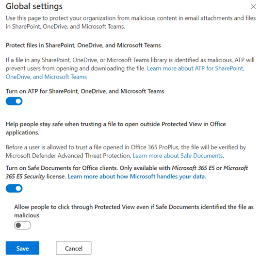
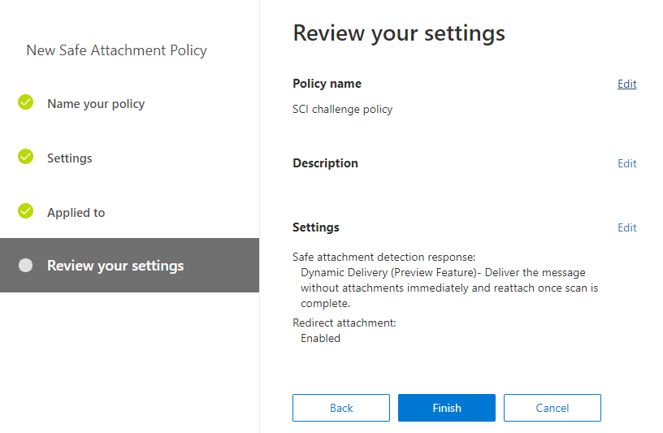
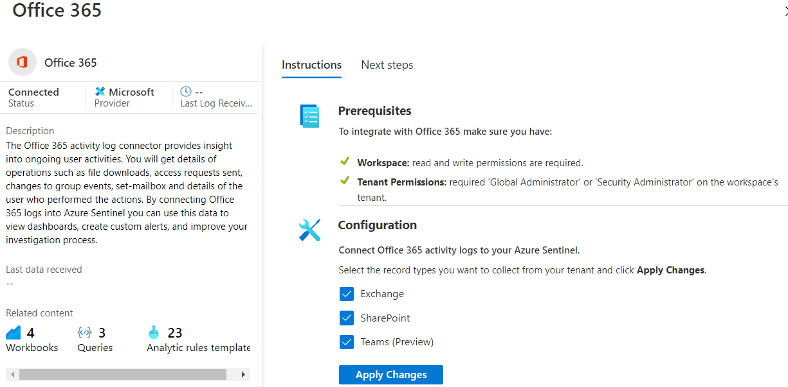
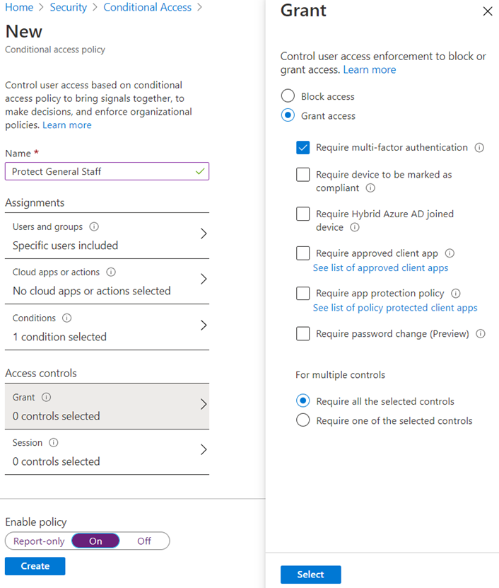
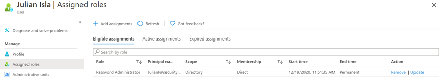

# Coaches Guide – Security, Compliance, and Identity

This guide is only meant to be a reference. Please **do not** rely on this guide in place of completing the challenges before coaching.

1. [OpenHack Introduction for Coaches](#OpenHack---An-Introduction-for-Coaches)
1. [Preparing to Coach the SCI OpenHack](#Preparing-to-Coach-the-SCI-OpenHack)
    - [Build Foundational Knowledge](#Build-Foundational-Knowledge)
    - [Complete the OpenHack Challenges](#Complete-the-OpenHack-Challenges)
    - [Prepare to Support Your Team](#Prepare-to-Support-Your-Team)
1. [General Expectations](#General-Expectations)
1. [General Troubleshooting Tips](#General-Troubleshooting-Tips)
1. [Tooling Prerequisites](#Tooling-Prerequisites)
1. [Challenge 1](#Challenge-1)
    - [Challenge 1 Follow Up Questions](#Challenge-1-Follow-Up-Questions)
1. [Challenge 2](#Challenge-2)
    - [Challenge 2 Follow Up Questions](#Challenge-2-Follow-Up-Questions)
1. [Challenge 3](#Challenge-3)
    - [Challenge 3 Follow Up Questions](#Challenge-3-Follow-Up-Questions)
1. [Challenge 4](#Challenge-4)
    - [Challenge 4 Follow Up Questions](#Challenge-4-Follow-Up-Questions)
1. [Challenge 5](#Challenge-5)
    - [Challenge 5 Follow Up Questions](#Challenge-5-Follow-Up-Questions)
1. [Challenge 6](#Challenge-6)
    - [Challenge 6 Follow Up Questions](#Challenge-6-Follow-Up-Questions)
1. [Challenge 7](#Challenge-7)
    - [Challenge 7 Follow Up Questions](#Challenge-7-Follow-Up-Questions)
1. [Challenge 8](#Challenge-8)
    - [Challenge 8 Follow Up Questions](#Challenge-8-Follow-Up-Questions)
1. [Challenge 9](#Challenge-9)
    - [Challenge 9 Follow Up Questions](#Challenge-9-Follow-Up-Questions)

## OpenHack - An Introduction for Coaches

OpenHack is a hands-on experience in which participants work in team to solve a series of coding challenges based on the requirements and resources provided. It is *not* designed to be delivered as a traditional training session or hands-on lab.

Your role as a coach is to encourage your team to work together to solve the challenges for themselves. You may provide critical assessment of their ideas and suggest potential avenues of exploration when they get stuck; but you should *not* provide solutions to the challenges. The outcome that customers value most from OpenHack is the satisfaction of having solved the challenges for themselves, and the in-depth learning that comes from that experience.

So, what *is* expected of a coach?

- Facilitating intra- (and inter-) team work to solve the challenges. Lead team discussions, being sure to include all team members. Act as a 'sounding board' for team brainstorming while helping the team focused on the challenges and their success criteria.
- Unblocking technical issues that are not directly related to the challenges (for example, command line syntax or network authentication issues).
- Explaining underlying concepts where necessary. Participants can often find the code they need in documentation or on sites like StackOverflow; but they may have difficulty understanding what it is that they are doing.
- Managing team sentiment and morale – the challenges are designed to be, er, challenging; and as a result, some participants may experience frustration at times during the OpenHack. Coaches need to be sensitive to the mood of the team and help steer them towards a breakthrough by asking leading questions, proposing alternative avenues of exploration, or just suggesting a coffee break.
- Validating challenge solutions against the specified criteria and approving team progress through the challenges; being sure to celebrate the team's successes along the way!

## Preparing to Coach the SCI OpenHack

Before coaching the SCI OpenHack, you should ensure you are fully prepared.

### Build Foundational Knowledge

Coaches for the SCI OpenHack require a knowledge of <!--provide resources-->

### Complete the OpenHack Challenges

Ideally, you should attend the SCI OpenHack as a participant before coaching it. If this is not possible, you should complete all the challenges on your own. You should try to complete the challenges using only the instructions that the OpenHack participants will have, but you can also use the NOTEs in the rest of this guide for more detailed information and context that may help you coach your team during the OpenHack itself.

*If no coach has experience with the team's chosen path, this is a growth opportunity for the coach to join in and learn with the team. As a coach, feel free to reference the contents of this folder to double check syntax when necessary.*

*If a solutions folder is provided for this OpenHack, these solutions were used to validate the challenges. Obviously, you might find this useful; but we encourage you to try to solve the challenges for yourself before referring to the solutions.*

### Prepare to Support Your Team

The guidance in the rest of this document incorporates insights from the content authors that describe the learning objectives for the challenges and how they are intended to be used, as well as hints and tips from previous coaches who have successfully helped customers as they work through the challenges. Be sure to read through these NOTEs, as they will help you ensure your team has a positive and successful OpenHack experience.

As the coach, consider your role as being the Chief Information Security Office (CISO) for the company. You are not responsible for the way workloads are divided among the team members. You will, however, represent the voice of the company's overall security, compliance, and identity protection scheme.

## General Expectations

The OpenHack consists of a series of challenges that reflect the experiences an organization may have as they begin improving or modernize their security, compliance, and identity posture. The challenges cross multiple security functions used to support an organization.

Most teams will **not** complete all the challenges within the time available. This is by-design (it is better to have some stretch-goal challenges for experienced attendees who may get through the challenges unusually quickly than to run out of challenges partway through the event!)

Generally, the authors expect 80-90% of attendees to complete only the first 7 challenges within a 3-day event – if your team does that, they will have learned a great deal about Azure security best practices and patterns as well as implementing security capabilities to protect their Azure and Microsoft 365 environment.

If your team does not reach the final challenge, you can unlock the remaining challenges at the end of the event and allow them to copy the challenge text and links. The OpenHack portal and associated Azure subscriptions will be deleted when the event ends, but attendees are welcome to use their own Azure subscription to continue working on the challenges on their own time provided they agree that *they will not publish the challenges or their solutions in any public location* such as a GitHub repo or blog. We want future attendees to have a great OpenHack experience, and if it is easy for them to find challenge solutions from previous attendees then they will not get the full benefit of having to work on the challenges for themselves.

Sample solutions are provided for each challenge as well as additional information that is intended to help you guide your team. The sample solutions are provided as one way to complete the items listed in the challenge's success criteria. In the spirit of the OpenHack, a team may find a different way to achieve the same result and these sample solutions should not be enforced as mandatory methods.  

## General Troubleshooting Tips

Check in on your team and be aware if they may be heading down a path that goes well beyond expectations. Creativity is expected in the OpenHack challenges, but you will want to guide your team if you see they are making the solution more complicated than expected. Don't shut them down but refer to the scenario and highlight key words or information that can focus their efforts.

Resources, accounts, groups, and other environment assets are not all provided. For example, if a policy is expected to be assigned to a security group, and that group does not exist, then create the group. If you feel something is missing and seems as if it should have been provided during the environment's creation, be sure to provide that as part of your feedback.

Be sure to have the team read the documents which included the overview document. Glancing over information to get to the "what do you want me to do" parts of the challenge will inevitably result in team member confusion.


## Tooling Prerequisites

It may help if the team has the <a href="https://docs.microsoft.com/powershell/azure/active-directory/install-adv2?view=azureadps-2.0" target="_blank">Azure Active Directory PowerShell for Graph module</a> installed.

There are no tools or PowerShell modules requirements. The team may choose to download and install tools that they are comfortable working with for user, account, policy management, etc.

**Note**: Please take care to encourage your hackers to use the newer portals where possible to avoid unexpected behaviour (Examples: use security.microsoft.com and compliance.microsoft.com instead of securitycenter.windows.com or protection.office.com. Issues can happen where some of the newer capabilities such as DLP for Endpoints are not available in protection.office.com, but is visible and configurable in compliance.microsoft.com.

## Challenge 1

**Scenarios goal**: Collect and discuss the different security and compliance reporting tools that are available as well as methods by which identified improvements or business requirements can be implemented.
The team will upgrade the organization's Azure Defender free tier product to Azure Defender.
Additionally, the team will acquire the free trial of Microsoft 365 Insider Risk Management and assign those licenses to all accounts.

**Note**: Check that the scripts have run correctly in your environment. It would have created the users below:


### General

The teams should not implement any improvements at this time. This challenge is intended to drive conversation among the team members and discovery of the Azure and Microsoft 365 deployment. It is not necessary to do deep dives into the procedures because the team will be doing that in later challenges.  

In addition to discovery, security defaults will be disabled in Azure Active Directory.

Use the following image to help describe Microsoft's Platform Approach to Security:
    

### Sample solution
#### **Turn off Security defaults in Azure Active Directory**

- Browse to the <a href="https://portal.azure.com/#blade/Microsoft_AAD_IAM/ActiveDirectoryMenuBlade/Properties" target="_blank">Azure Active Directory Properties blade</a>.  

- At the bottom of the blade, select **Manage Security defaults**.

    

- Under **Enable Security defaults**, select **No** and then save your change.

    

#### **Add the Insider Risk Management product to the subscription**

- Browse to the <a href="https://admin.microsoft.com/Adminportal/Home#/catalog" target="_blank">Microsoft 365 admin center Purchase services page</a>.

- Search for **Insider** and, in the results, locate **Microsoft 365 Insider Risk Management** and then select **Details**.

    

- On the Product details page, select **Start free trial**.

    

- On the confirm your order page, select **Try now**.

- On the order receipt page, select **Continue**.

#### **Assign Insider Risk Management licenses to all users**

- Browse to the <a href="https://admin.microsoft.com/AdminPortal/Home#/users" target="_blank">Microsoft 365 admin center Active users page</a>.

- Select all users and then select **Manage product licenses**.

    

- In the Manage product licenses pane, select **Assign more**, select **Microsoft 365 Insider Risk Management**, and then save your changes.

    

- In the Licenses assigned pane, select **Done**.

#### **Add your administrator account to the Insider Risk Management Admin role**

- Browse to the <a href="https://protection.office.com/permissions" target="_blank"> Office 365 Security &amp; Compliance</a> permissions page.

- In the Permissions list, select **Insider Risk Management Admins**.

- In the Insider Risk Management Admin card, next to Members, select **Edit**.

- Add your administrator account and then save your changes.  
It may take 30 minutes before the role updates in the service.

    >NOTE: You may need to sign out and then sign in again for permissions to be activated.

#### **Sample tools list**

You can use this list of tools to compare with the team's findings and discuss each in general. Where possible, align the tools to security, compliance, and identity which will help focus the team's efforts on later challenges.

- <a href="https://docs.microsoft.com/microsoft-365/security/mtp/microsoft-secure-score?view=o365-worldwide" target="_blank">Microsoft 365 Secure Score</a> (Security)  

    - Found in M365 Security Center (security.microsoft.com)  

    - Improvement actions organized by product  

- <a href="https://docs.microsoft.com/microsoft-365/compliance/compliance-manager?view=o365-worldwide" target="_blank">Microsoft Compliance Manager</a> (Compliance)  

    - Found M365 Compliance (compliance.microsoft.com)  

- <a href="https://docs.microsoft.com/azure/security-center/secure-score-security-controls" target="_blank">Azure Secure Score</a> (Security)  

    - Found in Azure Security Center  

- <a href="https://docs.microsoft.com/azure/security-center/security-center-compliance-dashboard" target="_blank">Regulatory compliance</a> (Compliance)  

    - Found in Azure Security center  

- <a href="https://docs.microsoft.com/azure/security-center/azure-defender" target="_blank">Azure Defender</a> (Security)  

    - Raw telemetry  

- <a href="https://docs.microsoft.com/azure/governance/blueprints/overview" target="_blank">Azure Blueprints</a> (Governance)  

- <a href="https://docs.microsoft.com/azure/governance/policy/overview" target="_blank">Azure policy</a> (Governance)  

    - Found in Azure Security Center  

- <a href="https://docs.microsoft.com/azure/security-center/tutorial-security-policy" target="_blank">Security policy</a> (Security)  

    - Found in Azure Security center  

- <a href="https://docs.microsoft.com/mem/" target="_blank">Microsoft Endpoint Manager</a> (Governance)  

- <a href="https://docs.microsoft.com/mem/intune/protect/conditional-access-intune-common-ways-use" target="_blank">Conditional access</a>  

- <a href="https://docs.microsoft.com/windows/security/threat-protection/microsoft-defender-atp/microsoft-defender-advanced-threat-protection" target="_blank">Microsoft Defender for Endpoint</a> (formerly Microsoft Defender ATP) (Security)  

    - Threat and vulnerability dashboard  

        - Raw telemetry  

- <a href="https://docs.microsoft.com/azure/active-directory/identity-protection/overview-identity-protection" target="_blank">Identity protection</a> (Identity)  

    - Azure AD  

- <a href="https://docs.microsoft.com/cloud-app-security/what-is-cloud-app-security" target="_blank">Microsoft Cloud App Security</a> (Security)  

    - Cloud App Security Portal  

- <a href="https://docs.microsoft.com/defender-for-identity/what-is" target="_blank">Microsoft Defender for Identity</a> (formerly Azure Advanced Threat Protection, also known as Azure ATP)  

- <a href="https://docs.microsoft.com/microsoft-365/compliance/data-loss-prevention-policies?view=o365-worldwide" target="_blank">Data loss prevention</a> (Compliance)  


### Additional references for the coach  

- <a href="https://docs.microsoft.com/azure/security/fundamentals/best-practices-and-patterns" target="_blank">Azure security best practices and patterns</a>  

- <a href="https://docs.microsoft.com/microsoft-365/security/office-365-security/security-roadmap?view=o365-worldwide" target="_blank">Security roadmap</a>  

### Additional information (third party)  

Although tools that are not part of Azure and Microsoft 365 were not part of the challenge, you may choose to introduce other useful products. For example:

- <a href="https://office365itpros.com/2019/11/14/orca-checks-office365-atp-settings/" target="_blank">ORCA</a>

- <a href="https://github.com/Canthv0/hawk" target="_blank">HAWK tool</a>  

### Troubleshooting Tips and FAQs

Use the following information to help navigate known situations that may present themselves during the challenge:  

There are many different URLs that the team will need to use throughout the OpenHack challenges. Encourage your team to record each of the admin, security, compliance, and identity URLs and what each can be used for. This will come in handy for later challenges.

Additional Information for Challenge 1: Permissions assigned in the Security & Compliance centre (protection.office.com) are NOT the same as the Roles assigned in the Azure portal – both have Security / Compliance administrator roles for example, but they work in a different fashion. Even if your Hacker accounts are Global Administrators, they will NOT inherit specific roles in the S&C centre – so here the hackers will need to give themselves appropriate rights to manage Insider Risk later on themselves. This can take several hours. Do this early on so you will have the correct permissions to perform the necessary steps in Challenge 5.
The same applies for licenses. There may be a delay until the services notice that you have assigned the Insider Risk Management licenses and later the M365 E5 licenses – until they are applied fully at the backend, some of the consoles displayed unusual behaviour.
Also, consider already assigning Admins the Mailbox Import Role, required for Challenge 4 (https://outlook.office365.com/ecp)

### Challenge 1 Follow Up Questions

Here are some example questions that may help review topics covered in this challenge:

- Was the team aware that there were so many resources to manage aspects of an organization's security, compliance, and identity?

- Did anyone know that Incidents identified in the Microsoft Defender Security Center will also be displayed in the Incidents node in Microsoft 365 security?

## Challenge 2

**Scenario goal:** Discuss the identified Microsoft 365 Secure Score improvements and implement corrective actions. The team should also have enabled Azure Defender and set the log analytics agent to deploy automatically.

### General

If there is no information populated in Office 365 Secure score or Azure Secure score for the team's tenants, use the CSV files and provide them to the team. The team will still be able to complete the improvement actions, however, they will have to know or research the steps needed to implement the improvement. If the Secure score results are present, each improvement action provides guidance for implementing the identified improvement.

### Sample solution
#### **Identify the improvement actions**  

- Browse to the <a href="https://security.microsoft.com" target="_blank">Microsoft 365 security</a> page and then open **Secure score**.
- Open the **Improvement actions** tab.  
    There may only be 10-12 improvement actions listed.

- The team should identify the improvement actions and implement those that are not planned for later.

- The improvement actions should have their status updated, such as 'Planned' when an implementation is not performed.

    

    NOTE: Completed implementations will not be listed as 'Complete' immediately; this is expected.  

#### **Enable Azure Defender**

- Browse to the <a href="https://portal.azure.com/#blade/Microsoft_Azure_Security/SecurityMenuBlade" target="_blank">Azure Security Center</a> blade.

- Under **Cloud Security**, select **Azure Defender**.

- Select **Enable Azure Defender**.

- Verify your subscription is selected and then, at the bottom of the page, select **Upgrade**.

- Verify your subscription is selected and then select **Install agents**.

#### **Configure ATP Safe attachments Global settings**

- Browse to the <a href="https://security.microsoft.com/safeattachmentv2" target="_blank">Microsoft 365 security Safe attachments</a> page.

- On the menu, select **Global settings**.

- Select the **Turn on ATP for SharePoint, OneDrive, and Microsoft Teams** switch to enable the feature.

- Select the **Turn on Safe Documents for Office clients** switch to enable the feature.

- Save the changes.  

    

#### **Create a new Safe attachments policy**

- Verify **Enable-OrganizationCustomization** is enabled.

- On the Safe attachments page, select **+ Create**.

- Create a new policy with the following settings:
    - Name the policy: create your own name for the policy.

    - Enable Dynamic Delivery.

    - Send blocked, monitored, or replaced attachments to the Administrator account.  

        - This could also be sent to a journaling or compliance mailbox.

    - Set **Applied to** to the hacker's onmicrosoft.com recipient domain.

    

#### **Configure the default Anti-phishing policy thresholds**

- Browse to the <a href="https://security.microsoft.com/antiphishing" target="_blank">Microsoft 365 security Anti-phishing</a> page.

- On the menu, select **Default policy**.

- In the Edit your policy Office365 AntiPhish Default window, next to **Advanced settings**, select **Edit**.

- Change the threshold to **2 Uses an aggressive level of settings for handling phishing messages**.

- Save your changes.

#### **Configure the default Anti-malware policy to block common attachment types**

- Browse to the <a href="https://security.microsoft.com/antimalwarev2" target="_blank">Microsoft 365 security Anti-malware</a> page.

- Select the **Default** policy.

- Edit the policy and then select **Common attachment types filter**.

- Select **On** and then save your changes.  

    

#### **Configure spam notification settings**

- Browse to the <a href="https://security.microsoft.com/antispam" target="_blank">Microsoft 365 security Mail filtering</a> page.

- Expand **Default spam filter policy**.

- In the center column, select the **Configure end-user spam notifications** link.

      

- Select the **Enable end-user spam notifications** check box.

- In the Default window, in the **Send end-user spam notifications every (days)** box, verify or enter **3**.

- Save your changes.

    

#### **Create the evaluation lab virtual machines in the Microsoft Defender Security Center**

- Browse to the <a href="https://securitycenter.windows.com/" target="_blank">Microsoft Defender Security Center</a> page.

- On the Welcome page, select **Next**.

- On the Set up your preferences page, select the data storage location and then select **Next**.

- Select the **Select the data retention policy** menu, choose an option, and then select **Next**.  
For the OpenHack, you can use the 30 day option.

- Select the **Select your organization size** menu, choose one of the organization sizes, and then select **Next**.

- From the **Select your industry** options menus, select one of the industry menus and then select **Next**.  
For example, you may choose the **Retail consumer products and services** > **Professional services** option.

- In the Preview experience section, you may set this option to **On** or leave it set to **Off** and then select **Next**.  
Wait for the instance to be created. This may take 3-5 minutes.

- On the Microsoft Defender for Endpoint is almost ready page, select **Start using Microsoft Defender for Endpoint**.  
It is not necessary to perform the device onboarding.

- In the **Setup incomplete** dialog box, select **Proceed anyway**.

- In the Microsoft Defender Security Center, in the left navigation, select **Evaluation and tutorials** and then select **Evaluation lab**.

- On the Welcome to the Microsoft Defender for Endpoint Evaluation lab page, select **Setup lab**.

- In the Lab configuration pane, on the Select your lab configuration tab, select **3 devices For 72 hours each** and then select **Next**.

    

- On the Install simulators agent page, select **Next**.  
The enabling the simulators will happen after setup.

- Review the information and then select **Setup lab**.

- Verify you see the **Evaluation lab was created** banner.

- On the Your evaluation lab page, in the right, under **Simulation integration**, select **Edit**.

    

- On the Install simulators agent page, under **Microsoft privacy statement** select **Provide consent by accepting the Microsoft terms** link and then select **I accept**.

- Select **Provide consent by accepting the information sharing statement** link and then select **I accept**.

- Select the **SafeBreach** check box.

- Enter the email address and name of one of the Hacker accounts and then select **Enable**.  

If you do not see the **Enable** button, with the **Last name** box select, on your keyboard press Tab, and then press Enter.

- Verify 1 of 2 simulators are listed as enabled.

    

- On the Your evaluation lab page, select **Add device**.

- In the Add device pane, select the **Device type** menu, choose either **Windows 10** or **Windows Server 2019**, and then select **Add device**.

- Record the device's username and password and then select **Done**.

- Preform the same steps to add a second device.  
You may want to have one of each device types, but this is not mandatory.

The devices will take 20-30 minutes to complete setup and installation of the simulator. There is no need to wait for these to complete. They will not be used until challenge 7.


### Troubleshooting Tips and FAQs

Use the following information to help navigate known situations that may present themselves during the challenge:

- If Secure score results are not present, have the team use the Microsoft Secure Score - Microsoft 365 security.csv found in the Coach's or General channels in Teams.

When you switch on MFA for all users, the hackers will get logged out and will have to setup MFA before they can continue working. There may be some resistance there for personal devices to be used. If this is the case, walk through the concept with your attendees, but do not switch them to MFA enabled to get around the issue.
The secure score will not reflect that you have switched this on regardless because it would require everyone to log in (including all the fictitious users of the challenge).

### Challenge 2 Follow Up Questions

Here are some example questions that may help review topics covered in this challenge:

- Why you want to use the simulation lab for testing versus a virtual machine running in one of your company's resource groups?

    - One reason may be for training purposes to demonstrate some known and dangerous attacks that will not alert Microsoft that attacks are targeting production resources.  

- Does secure score provide a reasonable evaluation of the organizations security settings for their estate?

    - Ideally, the answer would be 'Yes'. Be sure to have the team or you give 'why' examples.

- Are there other tools, native or third party that you may consider using or tools that you have found work well?

## Challenge 3

**Scenario goal:** The team must work together to identify necessary compliance improvement actions and implement the actions where possible. The Compliance manager in Microsoft 365 assessments and regulatory compliance in the Azure Security center will be used to identify the improvement actions.
Add

### General

Each team member will be assigned or select three improvement actions whose control maps to all three assessments. If this is not possible, choose the improvement actions that have two or more.  
The team members will:

- Implement the corrections and test.

- Update the implementation status and test status.

- Verify remediation has been updated in the assessment.  

The points achieved should increase as improvement actions are completed and the status updated.
For actions that cannot be performed in the OH environment, the team member must be able to describe how this was implemented and tested.  
The team will report their finding to you the CISO (aka Coach).

### Sample solution
#### **Add additional regulatory compliance assessments**

- Browse to the <a href="https://compliance.microsoft.com/compliancemanager" target="_blank">Microsoft 365 compliance</a> page.

- Select the **Assessments** tab and verify that the Data Protection Baseline assessment is listed.

- Select **Add Assessment**.
    - If there are no additional templates that can be selected, the team should continue using the baseline assessment.

- In the Create assessment window, select **ISO/IED 27001:2013** and then select **Next**.

- Provide a name for the Assessment name, like ISO 27001 and then assign to the existing group named **Default Group**.

- Create the assessment.  

      

- On the newly created assessment's page, select **Generate report**.

- Perform the same actions to create another assessment that is specific to the location or region where the OpenHack is being delivered.  

    - In an online delivery, the team should coordinate to determine the location or region and select the appropriate template.

#### **Using the report assessments, identify those improvement actions that relate to all three assessments**

- Each team member should select three improvement actions and implement the actions identified by the control.

- Updates to the implementation status will not be available immediately and may take up to 24 hours before they are shown as complete.

    >NOTE: If no reports are available, upload the available offline assessments to Files in your team's channel.

#### **Add the additional NIST SP 800-53 R4 compliance standard to Azure Regulatory compliance**

- In your Azure tenant, create a **Log Analytics Workspace** resource. For example:  

    

- After the log analytics workspace has been created, go to that resource.

- Locate and record the **Workspace ID**.  

    

- Browse to the <a href="https://portal.azure.com/#blade/Microsoft_Azure_Security/SecurityMenuBlade/22" target="_blank">Azure Security Center</a> blade.

- Select **Manage compliance policies**.

- Select your subscription.

- Under **Industry &amp; regulatory standards**, select **Add more standards**.

- In the list, select **NIST SP 800-53 R4**.

- On the initiative page, select **Assign**.

- For the **Scope**, select your subscription and the OpenHack resource group.

- On the **Parameters** tab, in the **Log Analytics workspace ID for VM agent reporting**, enter the workspace ID your recorded earlier.

- In the two **List of users** text boxes, enter **none**.
- Review and create the initiative.  

    

    >NOTE: The additional compliance policy will be available immediately and may take up to 24 hours before it is listed.  
    >If no reports are available, upload the available offline assessments to Files in your team's channel.

#### **Enable Azure Sentinel**

To enable the Microsoft Defender for Endpoint connector in Azure Sentinel, you must first enable the SIEM connector in Microsoft Defender for Endpoint.

- Browse to the <a href="https://securitycenter.microsoft.com/preferences2/siem/private" target="_blank">SIEM APIs in the Microsoft Defender Security Center</a>.

- Select **Enable SIEM connector**.  

    

- Review the output on the page and ***save the Client secret***.  
    You may need to use this again later if there are any problems with the connector.

    

- Browse to the <a href="https://portal.azure.com/#create/hub" target="_blank">Azure Marketplace</a>.

- Search for and select **Azure Sentinel**.

- In the Azure Sentinel workspaces blade, select **Create**.  

- Select **Add** and then select **Create a new workspace**.  

- In the Create Log Analytics workspace blade, create a new workspace using the following information:

    - Subscription: Use the existing subscription provided for the OpenHack.

    - Resource group: Select the resource group created for the OpenHack.

    - Name: Provide a name for the workspace. For example: secopsohworkspace.

    - Select a region and then select **Review + Create**.

- Review and then create the new workspace.

    

- Wait for the new workspace to be created.  

Refresh the list and verify the new workspace is displayed.

#### **Connect data sources in Azure Sentinel**  

- Select the newly created workspace and then select **Add**.

- From the navigation menu, select **Data Connectors**.  

This page lists all the connectors that Azure Sentinel provides and their status.

- In the Data connectors list, select **Azure Active Directory**.

- On the Azure Active Directory page, select **Open connector page**.

- On the Instructions page, select both the **Azure Active Directory Sign-in logs** and **Azure Active Directory Audit logs** check boxes.

- Select **Apply Changes**.

    

- In the bread crumb navigation, select **Azure Sentinel**.

- In the navigation menu, select **Data Connectors**.

- Search for and then select **Office 365**.  
You may see other connectors that start with Office 365. Use the connector named Office 365.

- Select **Open connector page**.

- Under **Configuration**, select **Exchange**, **SharePoint**, and **Teams** and then select **Apply Changes**.

    

- In the bread crumb navigation, select **Azure Sentinel**.

- In the navigation menu, select **Data Connectors**.

- Search for **Defender** and then select **Microsoft Defender for Endpoint**.

- Select **Open connector page**.

- Under **Configuration**, select **Connect**.

    

- In the bread crumb navigation, select **Azure Sentinel**.

- In the navigation menu, select **Data Connectors**.

- Search for **Azure Security** and then select **Azure Security Center**.

- Select **Open connector page**.

- Under **Configuration**, to the right of the OpenHack subscription, select **Connect**.

    

- In the bread crumb navigation, select **Azure Sentinel**.

- In the navigation menu, select **Data Connectors**.

- On the menu, select **Refresh** and then verify that four connectors are counted as connected.

    

### Additional coach notes and insights

The Compliance Manager presents a shared responsibility between the organization and Microsoft:  

- Assessments display the customer improvement actions and the actions Microsoft is responsible for monitoring and mitigating.  

The Azure Security center focuses on the status of deployed resources in Azure and regulatory requirements from a technical viewpoint.

### Troubleshooting Tips and FAQs

Use the following information to help navigate known situations that may present themselves during the challenge:

Like the security reports, if no compliance or regulatory compliance reports are available, use the available offline assessments found in the Coach's or General channel in Teams.

Consider using GDPR as the 3rd required regulation for this challenge as it doesn’t require an additional assessment license. Some previously free assessments now cost ~$30,000 a year, ideally avoid this conversation!

Suggest to your team members that instead of actually fulfilling the Compliance Score actions to set the actions as “planned”. This is to prevent them creating labels for example that may mix up/negatively affect settings and policies in a later challenge (challenge 4 or managing devices in challenge 8)

As you add Data Connectors in Azure Sentinel, you’ll notice some names have changed. Azure Security Center can no longer be added (it’s defaulted) and it is recommended to add MCAS as well as that’s going to be needed to prove Challenge 7 later on.

### Challenge 3 Follow Up Questions

Here are some example questions that may help review topics covered in this challenge:

- Would it be recommended to always use verbose logging for a log analytics agent?

    - Some services, such as Azure Firewall, if you have enabled logging and chosen a chatty resource to log (for example, setting the log to verbose) you may see significant impacts on your Log Analytics workspace storage needs.

- Microsoft responsible is responsible for some aspects of security and compliance, such as the physical datacenters. What, as the customer, are you always responsible for?

    -  Regardless of the type of deployment, the following responsibilities are always retained by you:  

        - Data

        - Endpoints

        - Account

        - Access management

    <a href="https://docs.microsoft.com/en-us/azure/security/fundamentals/shared-responsibility" target="_blank">Shared responsibility in the cloud</a>

## Challenge 4

**Scenario goal:** Deploy policies and configurations that support information protection and governance and insider risk management.  

### General

At the end of this challenge, the team will have:
Labeling:
- Created five sensitivity labels
    - Public
    - General
    - Confidential
    - Highly Confidential
    - Attorney Client Privilege  
- Created two sensitivity label policies
    - An org-wide policy
    - A policy scope to the Legal group
- Created a custom sensitive information type
    - Defines the keyword "ACP"  

Data loss prevention:  

- Created a DLP policy to prevent the sharing of customer data.

    - The policy will need to be applied to Exchange, Teams, SharePoint, and Devices.

    - Define the endpoint DLP settings to block Google Drive and Box and Copy to a USB removable media.

Insider risk management:  

- Created a data theft by departing users policy

### Sample solution
#### **Create five sensitivity labels**

- Browse to the <a href="https://compliance.microsoft.com/informationprotection?viewid=sensitivitylabels" target="_blank">Microsoft 365 compliance Information protection</a> page.

- On the Labels tab, locate and then select **+ Create a label**.

- You can use the following example information to create the new Public label:  

    - Name: Public

    - Display name: Public

    - Description for users: Public label used to identify publicly authorized content.

    - Scope: Files &amp; emails

    

- Create four more labels named **General**, **Confidential**, **Highly Confidential**, and **Attorney Client Privilege**. For each, include a basic description for users.

    

#### **Create an organization wide sensitivity label policy**

- On the Sensitivity labels page, select **Label policies**.

- Select **Publish label**.

- Select **Choose sensitivity labels to publish** and then add the **Public**, **General**, **Confidential**, and **Highly Confidential** labels.

- Publish the labels to **All** users and groups.

- Set the default label to **General**.

- Enable the following policy settings:  

    - Users must provide justification to remove a label or lower classification label.

    - Requires users to apply a label to their email or documents.

- Name the policy. For example: Organization label policy.

    

#### **Update the Highly Confidential label**  

This configuration may also have been completed when the label was created.

- Edit the **Highly Confidential** label.

- Enable **Mark the content of files**.

- Enable **Content marking** and add a watermark and header that uses the text **Highly Confidential**.

    

- Enable **Auto-labeling for files and emails**.

- Add **Sensitive info types** and select two sensitive info types such as **ABA Routing Number** and **U.S. Driver's License Number**.

- Verify **Automatically apply the label** is selected.

- Add a message to display. For example: Customer information has been found

      

- When complete, save the label changes.

    

#### **Create a sensitivity label policy for the Legal group**

- On the Sensitivity labels page, select **Label policies**.

- Select **Publish label**.  

- Select **Choose sensitivity labels to publish** and then add the **Attorney Client Privilege** label.  

- Publish the labels to **Legal** group.

- Set the default label to **None**.

- Name the policy. For example: Attorney Client Privilege label policy.

      

#### **Create a custom sensitivity information type**

- Browse to the <a href="https://compliance.microsoft.com/dataclassification?viewid=sensitiveinfotypes" target="_blank">Microsoft 365 compliance Data classification</a> page.

- On the Sensitivity info types tab, select **+ Create info type**.

- In the Choose a name and description page, enter the following:
    - Name: Attorney Client Privilege
    - Description: Detect content that contains ACP

- On the Requirements for matching page, select **+ Add an element** and configure the following settings and then select **Finish**:
    - Detect content containing: Keywords
    - In the keywords list, enter **ACP**, **"Attorney Client Privilege"**

    

#### **Define endpoint DLP settings to block Google Drive and Box**

The team may also choose to add Google and Box to the cloud service domains instead of unallowed apps.

- Browse to the <a href="https://compliance.microsoft.com/datalossprevention?viewid=globalsettings" target="_blank">Microsoft 365 compliance Data loss prevention</a> page.

- Expand **Unallowed apps** and then select **Add/update unallowed apps**.

- In the **App** box, enter **Google Drive**.

- In the **Executable name** box, enter **Googledrivesync.exe**, and then select **+**.

- Add the **Box** app using the **box.exe** executable.

- Save your changes.

    

#### **Create a DLP policy to prevent sharing of customer data**

Your team may choose to create a DLP policy for each configuration to protect customer data and block copying of data to USB devices and unallowed apps.

- Browse to the <a href="https://compliance.microsoft.com/datalossprevention" target="_blank">Microsoft 365 compliance Data loss prevention</a> page.

- Select **Create a policy**.

- Create a new policy using the **Custom policy** template using the following information:
    - Name: Prevent customer data sharing
    - Locations: Exchange email, SharePoint sites, OneDrive accounts, Teams chats and channel messages, and Devices.
    

    - Create a custom advanced DLP rule for content you want to protect:  

        - Add the **Content contains** condition.

            - You can use the same sensitive item types you used earlier.

        - Add the **Content is shared from Microsoft 365** condition.

            - Verify **Detects when content is sent in email message, Teams chat or channel message, or shared in a SharePoint or OneDrive document.​** > **with people outside my organization** is selected.

        

        - Under **Actions** select **Restrict access or encrypt the content in Microsoft 365 locations** and then select **Block only people outside your organization. User inside your organization will continue to have access**.

        - Select **Add an action** > **Audit or restrict activities on Windows devices**.

        - Set **Copy to a USB removable media** and **Access by unallowed apps** to **Block**.

            - If the team chose to use cloud service domains, they would choose to block *Upload to cloud service domains or access by unallowed browsers* instead of *Access by unallowed apps*.

        - Under **User notifications**, select **On**, and then select **Notify the user who sent, shared, or last modified the content**.

            

    - Turn the policy on right away.

- Review the settings and then submit the policy.

    

#### **Turn on auditing**  

This is part of configuring insider risk management and, as of this writing, is still located in the Office 365 Security and Compliance center. Auditing may already be configured from previous challenges.

- Browse to the <a href="https://protection.office.com/unifiedauditlog" target="_blank">Office 365 Security &amp; Compliance Audit log search</a> page.

- Select **Turn on auditing**.

#### **Add your administrator account to the Mailbox Import Export role**

- Browse to <a href="https://outlook.office365.com/ecp" target="_blank">Outlook on the web</a>.

- Select **permissions**.

- In the admin roles list, double-click or double-tap **Organization Management**.

- Under **Roles**, select **+**.

- Add the **Mailbox Import Export** role.  

- When complete, save your changes.  

NOTE: It may take 30 minutes before the role updates in the service.

#### **Create a CSV file that contains HR data**  

The CSV will list the employees who have recently resigned from the company and will be used to complete the insider risk management configuration.

- Prepare a CSV using the **Data theft by departing users** policy template with the **Employee resignations** HR data type.

- Create a new CSV file using the following format. Update the dates to the current date and update the resignation date to a date in the future.

```text  
EmailAddress,ResignationDate,LastWorkingDate
EricG@ContosoTeam1lab.onmicrosoft.com,2020-12-01T15:18:02.4675041+05:30,2020-12-30T15:18:02.4675041+05:30
```  

- Save the file as a .CSV file. For example: resigned.csv.

#### **Create an app in Azure Active Directory**  

The AD app is used to complete the insider risk management configuration.

- Browse to the <a href="https://portal.azure.com/#blade/Microsoft_AAD_IAM/ActiveDirectoryMenuBlade/RegisteredApps" target="_blank">Microsoft Azure App registrations</a> page.

- In the App registrations blade, select **New registration**.

- Enter a Name for your application. For example: Insider Risk Mgmt.

- Verify **Accounts in this organizational directory only (Contoso Mortgage only - Single tenant)** is selected.

- The redirect URI does not need to be configured.

- When complete, register the app.

    

- After the app has been registered, save the following information to NOTEpad or another NOTE taking app:
    - Application (client) ID.
    - Directory (tenant) ID.

- Add a client secret:
    - Under Manage, select **Certificates &amp; secrets** > **New client secret**.
    - Add a description: For example: RiskAppSecret.
    - Select a duration and then select **Add**.

- Using NOTEpad or another NOTE taking app, record the secret's value. You must record this value now.  
It is never displayed again after you leave this page.

#### **Create an HR data connector**

This connector will be used to complete the insider risk management task in the challenge.

- Browse to the <a href="https://compliance.microsoft.com/connectorlanding?viewid=allconnectors" target="_blank">Microsoft 365 compliance Data connectors</a> page.

- Scroll down, locate **HR** and then select **View**.

- On the HR Custom page, select **Add connector**.  

    You may need to sign out and sign in again if you see an information banner that reads "To add data connectors, you must be assigned the Mailbox Import Export role". If you have recently added the Mailbox Import Export role, you may need to wait until the permission has updated.

- Use the following information to create the connector:

    - Accept the terms of service.

    - Enter the Azure App Id you recorded earlier.

    - Name: Insider risk

    - HR scenario: Employee resignation

    - Select **Upload sample file** and then select **Upload sample file**.

    - Upload the CSV you created earlier.  

    - On the Map the HR scenarios to the columns in your file page, select each menu and choose the matching column name.

    - When complete, review the information and then select **Finish**.

    

- After the connector is created, copy the **connector job ID** value to NOTEpad or another text editor.

- Select the link to the sample script.

- In GitHub, copy the raw script.

- Create a new file and past the script contents into the file.

- Save the file as **hrconnector.ps1**.

- When complete, return to the Your connector was created page and then select **Done**.

#### **Upload your HR data**

- Open Windows PowerShell and change to the directory where you saved the hrconnector.ps1 script.

- Run the following command. Be sure to update the required information.

```powershell  
.\HRConnector.ps1 -tenantId <tenantId> -appId <appId> -appSecret <appSecret> -jobId <jobId>  -csvFilePath '<csvFilePath>'
```  

- Return to Microsoft 365 compliance and the Data connectors page.

- On the Connectors tab, verify the new connector is present and listed as **Connected**.

#### **Configure Insider risk management settings**

- Browse to the <a href="https://compliance.microsoft.com/insiderriskmgmt" target="_blank">Insider risk management</a> page and then, in the top right, select **Insider risk settings**.

- Select the **Policy indicators** tab.

- Select the **Select all** check boxes for the following:
    - Office indicators
    - Physical access indicators
    - Risk score boosters

- When complete, save your changes.

#### **Create a new insider risk management policy**  

If the Insider risk management feature or add-on is not available in the OpenHack tenant, the team should be able to describe the process used to create the policy in general.  

- Browse to the <a href="https://compliance.microsoft.com/insiderriskmgmt" target="_blank">Insider risk management</a> page and then select the **Policies** tab.

- Select **Create policy** to open the policy wizard.

- On the New insider risk policy page, complete the following fields:
    - Name: Enter a friendly name for the policy. For example: Indicators for data theft by departing users.
    - Under **Data theft**, select the **Data theft by departing users** template.

- Select **Next** to continue.

- Select the **All users and mail-enabled groups** check box and then select **Next**.

- On the Specify what content to prioritize (optional) page, select **Choose sensitivity labels**.

- Select the **Confidential**, **Highly Confidential**, and **Attorney Client Privilege** sensitivity labels and then select **Add**.

- Select **Next** to continue.

- On the Select policy indicators page, accept the default selections, and then select **Next** to continue.

- On the Policy timeframes page, accept the default setting and then select **Next** to continue.

- Review and then submit the policy for creation.

    

### Troubleshooting Tips and FAQs

Use the following information to help navigate known situations that may present themselves during the challenge:

Policies do not need to be tested. This is only being mentioned because they may not be fully deployed in the service shortly after being created and so they may not be triggered immediately when tested.

### Challenge 4 Follow Up Questions

Here are some example questions that may help review topics covered in this challenge:

- How does your organization use labels or DLP policies?

- Did you know about Insider risk management before today?

## Challenge 5

**Scenario goal:** Configure conditional access policies to support different security group requirements based on business rules. Configure privileged identity management rules to elevate permissions only when necessary. Establish alerting for risky sign in behavior and enforce a password change policy for sign ins identified as Medium or High.

### General

Solution should include creating the following:

- Conditional access rule for that will enforce MFA for users assigned the Password Administrators role.

- Conditional Access rule for the "General Staff" group that allow them to work from anywhere but enforces MFA if not at a trusted location.  

- Conditional Access rule for the "Financial System Access" group. These members can only log on from trusted locations.  

- When testing the conditional access policies, team members can impersonate the volunteer users.

- Trusted locations defined with at least one IP address of a trusted location to sign in from. One of the public IP addresses of a team member is an example of a trusted location access.  

- Identity Protection policy setup to enforce password change when any users risk level is set to Medium or High. If students cannot simulate a risk event to trigger this rule, then at least check that they have the policy configured on PIM.  

- Privileged Identity Management configured to assign the "Password Administrator" role to Julian Isla, but their default role is User as observed in their profile.  

### Sample solution  

#### **Create a named location for Contoso Mortgage headquarters**  

- The team should Identify one of the team member's public IP addresses and use that as the IP address for the company headquarters.  

For this task, you should use your public IP address.

- Browse to the <a href="https://portal.azure.com/#blade/Microsoft_AAD_IAM/SecurityMenuBlade" target="_blank">Azure Active Directory Security</a> blade.

- In the Resource menu, select **Named locations**.

- In the Named locations blade, select **New location**.

- In the **Name** box, enter a name for the company headquarters. For example: **Contoso Mortgage HQ PIP range**.

- Select the **Mark as trusted location** check box.

- In the **IP ranges box** enter your public IP in CIDR format.  

You may choose to use the IP address only using the **&#x2F;32** mask or **&#x2F;24** mask to include a range of IP addresses.

- Select **Create**.

#### **Create a conditional access policy for the Financial Systems Access security group**

- Browse to the <a href="https://portal.azure.com/#blade/Microsoft_AAD_IAM/SecurityMenuBlade" target="_blank">Azure Active Directory Security</a> blade.

- In the Resource menu, select **Conditional Access**.

- Select **New policy**.

- Create the new policy using the following settings:

    | Setting | Value |
    |----|----|
    | Name | Protect Financial Systems Access staff |
    | Assignments > Users and groups > <br> Select users and groups > Users and groups | Financial Systems Access |
    | Conditions > Locations > Configure | Yes |
    | Selected locations | All trusted locations |
    | Access controls > Grant | Grant access > Require multi-factor authentication |
    | Enable policy | On |

    

    

    

#### **Create a conditional access policy for the General Staff security group**

- Browse to the <a href="https://portal.azure.com/#blade/Microsoft_AAD_IAM/SecurityMenuBlade" target="_blank">Azure Active Directory Security</a> blade.

- In the Resource menu, select **Conditional Access**.

- Select **New policy**.

- Create the new policy using the following settings:

    | Setting | Value |
    |----|----|
    | Name | Protect General Staff |
    | Assignments > Users and groups > <br> Select users and groups > Users and groups | General Staff |
    | Conditions > Locations > Configure | Yes |
    | Selected locations > Include | Any location |
    | Selected locations > Exclude | All trusted locations |
    | Access controls > Grant | Grant access > Require multi-factor authentication |
    | Enable policy | On |

    

    

    

    

#### **Add PIM assignment**

- Browse to the <a href="https://portal.azure.com/#blade/Microsoft_Azure_PIMCommon/CommonMenuBlade/quickStart" target="_blank">Privileged Identity Management</a> blade.

- Select **Manage access**.

- In the Resource menu, select **Assign roles** and then select **Add assignments**.

- Select **Add assignments**.

- In the Add assignments blade, select the **Role** menu and then select **Password Administrator**.  
Alternatively, you could have selected the role from the Azure AD roles list on the previous blade.

- Verify **Scope type** is set to **Directory**.

- Under **Select member(s)**, select the **No member selected** link.

- In the Select member pane, select **Julian Isla** and then select **Select**.

    

- On the Add assignments blade, select **Next**, accept the default values, and then select **Assign**.

    

#### **Configure and verify the Password Administrator PIM assignment**

- On the Azure AD roles blade, select **Password Administrator**.

- In the navigation pane, select **Role settings**.

- On the Role settings blade, select **Edit**.

    

- On the Activation tab set the **Activation maximum duration (hours)** to **4** or fewer hours.

- Change **On activation, require** to **Azure MFA** and then select **Update**.

    

- Browse to the <a href="https://portal.azure.com/#blade/Microsoft_AAD_IAM/UsersManagementMenuBlade/MsGraphUsers" target="_blank">Azure Active Directory All users</a> blade.

- Select **Julian Isla**.

- In the Resource menu, select **Assigned roles** and then select the **Eligible assignments** tab.

- Verify **Password administrator** is listed.

    

#### **Create a new conditional access rule to enforce MFA for Password Administrator role members**

- Browse to the <a href="https://portal.azure.com/#blade/Microsoft_AAD_IAM/ConditionalAccessBlade/Policies" target="_blank">Azure Active Directory Conditional Access Policies</a> blade.

- Select **+ New policy**.

- Create the new policy using the following settings:

    | Setting | Value |
    |----|----|
    | Name | Enforce MFA for Pwd Admins |
    | Assignments > Users and groups > <br> Select users and groups > Directory roles | Password administrator |
    | Access controls > Grant | Grant access > Require multi-factor authentication |
    | Enable policy | On |

    

    

#### **Update the User risk policy to force password change for medium or above User risk**

- Browse to the <a href="https://portal.azure.com/#blade/Microsoft_AAD_IAM/SecurityMenuBlade" target="_blank">Azure Active Directory Security</a> blade.

- In the Resource menu, select **Identity Protection**.

- In the Resource menu, select **User risk policy**.

- In the User risk policy, under **Assignments**, select **Low and above**.

- In the User risk pane, select **Medium and above** and then select **Done**.

    

- Under **Controls**, select **Access** > **Block access**.

- In the access pane, select **Allow access**, verify the **Require password change** box is selected, and then select **Done**.

    

- Under **Enforce policy**, select **On** and then save your changes.

#### **Update the Sign-in risk policy to force MFA for medium or above sign-in risk**

- Browse to the <a href="https://portal.azure.com/#blade/Microsoft_AAD_IAM/SecurityMenuBlade" target="_blank">Azure Active Directory Security</a> blade.

- In the Resource menu, select **Identity Protection**.

- In the Resource menu, select **Sign-in risk policy**.

- In the Sign-in risk policy, under **Assignments**, select **Low and above**.

- In the Sign-in risk pane, select **Medium and above** and then select **Done**.

- Under **Controls**, select **Access** > **Block access**.

- In the access pane, select **Allow access**, verify the **Require multi-factor authentication** box is selected, and then select **Done**.

- Under **Enforce policy**, select **On** and then save your changes.

### Troubleshooting Tips and FAQs

Use the following information to help navigate known situations that may present themselves during the challenge:

When denying specific locations, you may need to disable or remove a conditional access policy.

### Challenge 5 Follow Up Questions

Here are some example questions that may help review topics covered in this challenge:

- What reasons might an organization have for restricting sign in locations?  

- What other scenarios can PIM be helpful?  

- If trusted locations or their IPs change often, can the list of trusted IP/location be updated programmatically?  

- Can you think of other common roles/scenarios in the enterprise that we might create conditional access rules for?  

## Challenge 6

**Scenario goal:** This challenge focuses on Azure policy. The team will need to understand the differences between policies and initiatives. They should understand the different types of policy effects. They will use policies to monitor and enforce the required standards. They will be asked to create and enforce Azure policies on the company's deployed resources.  
Participants who are new to Azure policy will need to review the resources to be able to differentiate the effects of the different policy types.  

### General

When complete, your team should have been able to create a single policy initiative containing sixteen policies. As a best practice, the team will duplicate the default policy and add that to their initiative. Each policy will be further configured where required meet the challenge scenario. Here are the categories the policy categories and the built-in policies that are used.

#### General

- Policy: Allowed locations

    - Only allow resources to be deployed to the region where the Contoso Mortgage HQ is located.

#### Tags

- Policy: Require a tag and its value on resources

    - All resources should be tagged with a tag named "Cost Center".  

#### Compute

- Policy: Allowed virtual machine size SKUs

    - VM sizes must be in the D-series v3 or E-series v4 families.  

- Policy: Deploy default Microsoft IaaSAntimalware extension for Windows Server

    - VMs must have the Microsoft Anti-malware extension installed automatically.  

#### Security Center  

- Policy: Management ports of virtual machines should be protected with just-in-time network access control

    - Management access should be configured with just-in-time access.  

- Policy: Azure DDoS Protection Standard should be enabled

    - Networks without the DDoS Protection Standard enabled should be audited.  

#### Event Hub

- Policy: Diagnostic logs in Event Hub should be enabled

    - Diagnostic logs in Event Hub should be enabled.

#### Monitoring

- Policy: Activity log should be retained for at least one year

    - Activity logs must be retained for at least one year.

- Policy: Deploy - Configure Log Analytics agent to be enabled on Windows virtual machines and Deploy Log Analytics agent for Linux VMs

    - The Log Analytics agent must automatically be deployed to virtual machines.  

#### Network

- Policy: &#91;Preview&#93;: All Internet traffic should be routed via your deployed Azure Firewall

    - All network traffic is routed through an Azure Firewall.  

- Policy: Flow log should be configured for every network security group

    - Subnets should have flow logs configured.  

- Policy: Network interfaces should disable IP forwarding  

    - NICs must not allow IP forwarding to be enabled.  

#### Storage  

- Policy: Secure transfer to storage accounts should be enabled

    - Secure transfer must be enabled.  

- Policy: Storage accounts should restrict network access

    Storage accounts must only be accessible from Azure networks.  

- Policy: Geo-redundant storage should be enabled for Storage Accounts

    - Storage accounts that do not have geo-redundancy enabled should be audited.

### Sample solution  

#### **Create policy definitions**

- Browse to the <a href="https://portal.azure.com/#blade/Microsoft_Azure_Policy/PolicyMenuBlade/Overview" target="_blank">Azure Policy</a> blade.

- In the Resource menu, select **Definitions**.

- Under the menu bar, in the **Search** box on the right, search for **Allowed locations**.

- In the results, to the right of **Allowed locations**, select the ellipsis and then select **Duplicate definition**.

    >NOTE: As a best practice, the built-in definitions should be duplicated to avoid the potential of a policy being changed or affected by any definition updates deployed in the service.

- On the Allowed locations page, to the right of the **Definition location** box, select the ellipsis.

- In the Definition location page, select the **Subscription** menu, select your OpenHack subscription, and then select **Select**.

- In the **Name** box, prepend **OH-** to the exiting name.  
For example, Allowed locations will be OH-Allowed locations.

- Review the remaining settings and then select **Save**.

- Using the previous steps, duplicate the following definitions:

    - Require a tag and its value on resources

        - Prior to saving this definition, in the **POLICY RULE** editor, located **line 18** and change **Tag Name** to **Cost Center**.

    - Allowed virtual machine size SKUs.

    - Deploy default Microsoft IaaSAntimalware extension for Windows Server.

    - Management ports of virtual machines should be protected with just-in-time network access control.

    - Azure DDoS Protection Standard should be enabled.

    - Diagnostic logs in Event Hub should be enabled.

    - Activity log should be retained for at least one year.

    - Deploy - Configure Log Analytics agent to be enabled on Windows virtual machines.

    - Deploy Log Analytics agent for Linux VMs.

    - &#91;Preview&#93;: All Internet traffic should be routed via your deployed Azure Firewall.

    - Flow log should be configured for every network security group.

    - Network interfaces should disable IP forwarding.

    - Secure transfer to storage accounts should be enabled.

    - Storage accounts should restrict network access.

    - Geo-redundant storage should be enabled for Storage Accounts.

- When complete, search for **OH-** and then verify you have created sixteen new definitions.

    

#### **Create an Azure policy initiative definition**

- If necessary, browse to the <a href="https://portal.azure.com/#blade/Microsoft_Azure_Policy/PolicyMenuBlade/Overview" target="_blank">Azure Policy</a> blade.

- In the Resource menu, select **Definitions**.

- On the Definitions page, select **+ Initiative definition**.

- On the Initiative definition page, in the **Name** box, enter a name for the initiative. For example: Contoso Mortgage required policies.

- Under **Category**, you may choose to **Create new** or **Use existing**. In this sample solution, you can create a new category. For example, Company requirements.

- In the **Version** box, enter **1.0.0** and then select **Next**.

- On the Policies tab, select **Add policy definition(s)**.

- In the **Search** box, enter **OH-** and then select all OH- policy definitions.

- When complete, select **Add** and then select the **Policy parameters** tab.

- On the Policy parameters tab, use the following information to configure each of the policy definitions that have a **Set value** value type.  

Those listed with default values do not need to be changed and are not listed here.  

- OH-Require a tag and its value on resources

    - Value: **Information Technology**

    >NOTE: You may see a second Require tag policy. If this occurs, set the value to **Not used**.  

- OH-Allowed virtual machine size SKUs  

    - Value: select all **Standard_D** and **Standard_E** series **_v3** SKUs  

    Use the filter box and enter **v3** to identify all v3 SKUs and then select the D and E series.

- OH-Allowed locations

    - Value: Select the region(s) that align with the agreed upon company headquarters location.  

    For example, if the team decides the company headquarters is in the central United States, they can choose Central US or all United States locations or any combination of East, Central, or West US locations. The goal is to have the team set the location and justify the reason for the location if asked.

- OH-Deploy - Configure Log Anlytics agent to be enabled on Windows virtual machines
    - Value: **secopsohworkspace**

- OH-Deploy Log Analytics agent for Linux VMs
    - Value: **secopsohworkspace**

- When complete, the policy parameters should look similar to the following:

    

- Select **Next**.  

- Review the initiative definition and then select **Create**.

#### **Assign the newly created initiative definition**

- On the Azure Policy blade Definition page, select the initiative definition you created in the previous task.

- On the Initiative Definition page, select **Assign**.

- On the Assign initiative page, select **Review + create** and then select **Create**.

    >NOTE: The scope is not important for the challenge. This could, however, be a coach conversation with the team about scoping policies for management groups, subscriptions, or resource groups.

#### **Create a new subnet for the Azure Firewall**

- - Browse to the <a href="https://portal.azure.com" target="_blank">Azure portal</a>.

- On the Home page, select **Resource group** and then select **openhackscirg**.

- In the resources list, select the **VNET1** virtual network.

- In the Resource menu, under **Settings**, select **Subnet**.

- On the Command bar, select **+ Subnet**.

- Create a new subnet using the following settings:

    | Setting | Value |
    |----|----|
    | Name | AzureFirewallSubnet |
    | Subnet address range | 10.0.3.0/24|

    You do not need to change any other default settings.

- In the **Subnets** list, verify the new subnet is shown.

#### **Deploy and configure Azure Firewall using the Azure portal**

- In the breadcrumb navigation menu, select **openhackscirg**.

- On the Command bar, select **+ Add**.

- On the Create a resource blade, search for **Firewall**.

- In the resulsts, select **Firewall** and then select **Create**.

- Create the firewall using the following settings:

    | Setting | Value |
    |----|----|
    | Name | AzFw01 |
    | Firewall policy | *create a new firewall policy named OHFWPolicy using the standard tier* |
    | Choose a virtual network | Use existing |
    | Select virtual network | VNET1 |
    | Public IP address | Add new <br> *create a new public IP name OHFWpubIP*|

- After the firewall resource has been deployed, select **Go to resource**.

- Locate and record the private IP address.

- In the Resource menu, under **Settings**, select **Public IP configuration**.

- Record the assigned IP Address.

#### **Create and deploy a default route**

- On the Azure portal menu, select **All services**.

- In the Resource menu, select **Networking**.

- Select **Route tables**.

- Select **+ Add**.

- Create the new route using the following information:

    | Setting | Value |
    |----|----|
    | Resource group | openhackscirg |
    | Region | *use the currently selected region* |
    | Name | OHdefaultRoute |

- When creation is complete, select **Go to resource**.

- In the Resource menu, under **Settings**, select **Subnets**.

- On the Subnets pane, select **+ Associate**.

- In the Associate subnet pane, set the **Virtual network** to **VNET1**.

- Select the **Subnet** menu, select **Subnet1**, and then select **OK**.

- In the Resource menu, under **Settings**, select **Routes** and then select **+ Add**.

- Create a new route using the following information:

    | Setting | Value |
    |----|----|
    | Route name | OHroute01 |
    | Address prefix | 0.0.0.0/0 |
    | Next hop type | Virtual appliance |
    | Next hop address | *enter the AzFw01 private IP address* |

- Verify the new route is displayed.  
You may need to refresh the page.

#### **Create a network rule to allow all outbound connections to http and https**
This rule can be used to test the functionality of the firewall by allowing outbound traffic to the internet. Prior to creating an application rule, the firewall blocks all interent bound traffic.

- Browse to the **openhackscirg** resource group and then select **AzFw01**.

- In the **Overview** pane, under **Firewall policy**, select **OHFWPolicy**.  
This is the default policy created when the Azure Firewall was deployed.

- In the Resource menu, under **Settings**, select **Network Rules**.

- On the Command bar, select **+ Add a rule collection**.

- Create a new rule collection using the following information:

    | Setting | Value |
    |----|----|
    | Name | allow_network |
    | Priority | 200 |
    | Rule collection group | DefaultNetworkRuleCollectionGroup |
    | Rules > Name | allow-web |
    | Rules > Source type | IP Address |
    | Rules > Source | * |
    | Rules > Protocol | TCP |
    | Rules > Destination Ports | 80,443 |
    | Rules > Destination Type | IP Address |
    | Rules > Destination | * |

- When complete, verify the rule collection is listed.

### Troubleshooting Tips and FAQs

Use the following information to help navigate known situations that may present themselves during the challenge:

- There may be existing policies created for hosting the OpenHack, the team can ignore these.
- The Challenge description mentions an Azure Firewall, however one hasn’t been created, nor are there steps to create them in coaches-guide. The challenge will continue to work fine with or without a firewall, however your team may go off and create it.

**Known issue**: A back-end service changed and as a result the Policy “Require a tag and its value on resources” no longer works in this context and should be omitted as you are creating the initiative assignment. If you do deploy it, you will run into a Policy violation error as you create the Logic App in Challenge 7.

### Challenge 6 Follow Up Questions

Here are some example questions that may help review topics covered in this challenge:

- Do you use Azure policies in your company? If not, do you see where these policies can be useful?

## Challenge 7

**Scenario goal:**  
The team must run a simulated attack against a test device in the Microsoft Defender Security Center. Once complete, the team should be able to identify different elements of the attack. Additionally, the team must create one advanced hunting rule that identifies antivirus reports from a specific target device. As part of the larger security effort, the team will create an Azure Playbook to alert team members if an incident occurs in the Azure Security Center. A new analytics rule also needs to be created in Azure Sentinel that will monitor Cloud App Security for any medium or high severity alerts.

### General

At the completion of this challenge, the team will have successfully executed the ATP29 attack simulation against one of the test devices. They will have created and saved an advanced hunting query.

### Sample solution

The team should launch the attack simulation as soon as possible because it may take 20-30 minutes to complete.

#### **Run the ATP29 attack simulation against one of the lab devices**

For the team to choose the correct attack simulation, they must recognize the clue in the challenge content. The challenge specifies the team should "run an attack delivered by SafeBreach that simulates techniques such as malware infection, data collection and modification of registry keys".  

The ATP29 attack description is:

SafeBreach simulates attacks for local host infection and malicious behavior, performed by APT29 &#40;Cozy Bear&#41; threat group.

This includes techniques such as malware infection, data collection and the modification of registry keys and OS configurations.  

- Browse to the <a href="https://securitycenter.windows.com/evaluation" target="_blank">Microsoft Defender Security Center evaluation lab</a> page.

- Verify that two test devices have been provisioned and are active.

- Verify the simulator has been installed. From the **Simulator status** column, point to the **information** icon to the right of **Multiple** and review the simulator status. If the simulator is not installed, you must first install it before an attack simulation can be run against the device.

    

- In the Evaluation suggestions pane on the right, verify that **Simulation integration** shows **1&#47;2 simulators enabled**. This simulator that should be enabled is for SafeBreach.  
If necessary, select **Edit** and verify SafeBreach is selected or, in the Test devices table, select the information icon to the right of **Multiple** in the Simulation column.

- Under **Simulations overview**, select **go to simulation gallery**.

    

- On the Simulations &#38; tutorials page, scroll down and, under **APT29**, select **Run simulation**.

- In the Create simulation pane, use the **Select device** menu and select one of the test devices and then select **Create simulation**.

- Return to the Your evaluation lab page and monitor the simulation.  
The simulation will take 8-30 minutes to complete.

#### **Create an Azure playbook that notifies all hacker team members when a high-severity alert is reported in the Azure Security Center**

- Browse to the <a href="https://portal.azure.com/#blade/Microsoft_Azure_Security_Insights/WorkspaceSelectorBlade" target="_blank">Azure Sentinel</a> blade.

- Select the **secopsohworkspace**.

- In the Resource menu, under **Configuration**, select **Automation**.

- In the **Automation** pane, on the Command bar, select **Create** > **Add new playbook**.

- On the Create a logic app page, in the **Resource group** box, select the existing **openhackscirg** resource group.

- In the **Logic app name** box, enter a name. For example, Notify_SecOps_team.

- Select a region and then select **Review + create**.  
Remember, the new logic app must be deployed to the location identified in the Azure resource policy.

- Select **Create**.

- When the deployment is complete, on the Deployment details blade, select **Go to resource**.  
This will open the Logic Apps Designer.

- On the Logic Apps Designer page, in the **Templates** section, select the **Category** menu and then select **Security**.

- In the results, select **Get a notification email when Security Center detects a threat**.

- Review the template information and then select **Use this template**.

- To the right of **Office 365 Outlook**, select the **+** sign in icon.  
This will create the OAuth connection to Outlook.

- Sign in using your hacker account or other email address in the OpenHack environment.

- To the right of **Security Center Alert**, select the **+** create icon.

- Select **Continue**.

- In the **Send an email (V2)** step, enter the email addresses for the team members.

- Review the information that will be contained in the message and then select **Save**.

#### **Create an Azure Sentinel Analytics rule**

- Browse to the <a href="https://portal.azure.com/#blade/Microsoft_Azure_Security_Insights/WorkspaceSelectorBlade" target="_blank">Azure Sentinel workspaces</a> blade and then select your analytics workspace.

- In the Resource menu, select **Analytics**.

- On the menu, select **Create** > **Microsoft incident creation rule**.

- Create a name for the rule. For example, CAS analytics rule for medium and high severity alerts.

- Select the **Microsoft security service** menu and then select **Microsoft Cloud App Security**.

- Under **Filter by severity**, select **Custom**.

- Select the **Custom** menu and then select the **Medium** and **High** checkboxes.

- When complete, review and then create the new analytics rule.

    

#### **Questions from the scenario**

- Question:  What threat actor has been identified from the tactics, techniques and procedures (TTPs) used during this attack?  

    - Yttrium.  

    - One way you can find this is by selecting the **A backdoor has been detected** High alert.

        

- In the Incidents > A backdoor has been detected page, find the actor activity entry.

    

- Question:  What aliases is this threat actor known by?  

    - APT29, The Dukes

    - From the A backdoor has been detected page, in the ALERT STORY, select **Yttrium Actor activity detected**.

    - In the Details pane, scroll down to the **Aliases** section to identify the other names used by the threat actor.

        


- Question:  What is this threat actor’s method of choice?  

    - YTTRIUM uses spear-phishing as its method of choice to compromise targeted individuals.

        

- Question: How many processes and files were used in this attack?  

    - 10 and 26 respectively.  

    >NOTE: This may be different depending on the number of targets used.  

    - Select the **Multi-stage incident involving Execution & Persistence on multiple endpoints** incident and then select **Evidence** tab.

        

- Question: Using investigation ID 1, how many files, drivers and IP addresses were analyzed?  

    - 9726, 373 and 83 respectively  

    >NOTE: This may be different depending on the number of targets used.  

    - Select the **Multi-stage incident involving Execution & Persistence on multiple endpoints** incident and then select the **Investigations** tab.

        

    - Select **'OnionDuke' high-severity malware was detected** which is ID 1.

    - On the Investigation graph tab, review the **Entities analyzed** table for the requested information.

        

    >NOTE: Because this is a simulation, there will be no threats found. This does show how this can be used for a real-life incident.

#### **Create an advanced hunting query**

- In the Microsoft Defender Security Center, in the Resource menu, select **Advanced hunting**.

- Select the **Query** tab.

- In the query box, enter:

    ```kusto  
    // Query for Windows Defender Antivirus detections.
    DeviceEvents
    | where ActionType == "AntivirusDetection"
    | where DeviceName contains "test"
    ```  

- On the menu, select **Save** > **Save**.

- Enter a name for the query, verify the **Folder** location is **My queries**, and then select **Save**.

- Task: Look for Powershell execution events

    - In advanced hunting run following query:

    ```kusto  
    // Finds PowerShell execution events.
    DeviceProcessEvents
    | where Timestamp > ago(30d)
    | where FileName in ("powershell.exe", "POWERSHELL.EXE", "powershell_ise.exe", "POWERSHELL_ISE.EXE")
    | project Timestamp, DeviceName, InitiatingProcessFileName, FileName, ProcessCommandLine
    | top 100 by Timestamp
    ```  

- Question:  What parent process started net.exe?

    - In advanced hunting run following query:

    ```kusto  
    // The query finds attempts to list users or groups using Net commands
    DeviceProcessEvents
    | where Timestamp > ago(7d)
    | where FileName == 'net.exe'
    ```  

### Troubleshooting Tips and FAQs

Use the following information to help navigate known situations that may present themselves during the challenge:

- If using Google Chrome and the logic app is unable to authenticate when being created, retry using Microsoft Edge Chrome.

Consider steering the team to the APT29 SafeBreach attack simulation for consistency (to make sure the follow-on questions make sense and if you and the team create a hunting queries, you can help them better.  

### Challenge 7 Follow Up Questions

Here are some example questions that may help review topics covered in this challenge:

- With respect to network attacks, what is living-off-the-land?

    - Fileless/malware-less attacks that turn a system's own native tools against itself.

If you receive a policy violation as you are creating the Logic App, please read Challenge 6 Troubleshooting Tips and FAQs.

## Challenge 8

**Scenario goal:**  

The team will be expected to configure Microsoft Endpoint Manager to automatic enrollment devices based on a user's group membership and enable Microsoft Defender for Endpoint in Intune so that it can be used when onboarding devices. Using the newly onboarded device, the team will run an attack simulation from Microsoft Defender for Endpoint and analyze the attack. For employees, the team will use the attack simulator in Microsoft 365 security to deploy simulated attacks against target mailboxes and experience some available methods that can be used to help educate and evaluate readiness.

### General
When complete, the team will have deployed features in found in Microsoft Endpoint Manager to include automatic enrollment of devices and deployment of Microsoft Defender for Endpoint using Intune. The team will have used a simulated attack against a deployed workstation and evaluated the event in Microsoft Defender for Endpoint. Finally, the team will test the capabilities of the attack simulators found in Microsoft 365 security.

### Sample solution

#### **Enable Microsoft Defender ATP in Intune**

- Browse to the <a href="https://endpoint.microsoft.com" target="_blank">Microsoft Endpoint Manager admin center</a> blade.

- Select **Endpoint security** > **Microsoft Defender ATP**.

- Select **Connect Microsoft Defender ATP to Microsoft Intune in the Microsoft Defender Security Center​**.

- In Microsoft Defender Security Center, select **Settings** > **Advanced features**.

- Enable the connection to Intune and then save the changes.

- Return to Microsoft Defender ATP in the Microsoft Endpoint Manager admin center and refresh the page.  

- Under MDM Compliance Policy Settings, set **Connect Windows devices version 10.0.15063 and above to Microsoft Defender ATP** to **On**.

- Save your changes.  
If the **Save** option is not displayed on the menu, refresh the screen and the navigate back to **Microsoft Defender ATP**.

#### **Create a device configuration profile to configure ATP sensor**

- In the Microsoft Defender ATP blade, at the bottom of the page, select **Create a device configuration profile to configure ATP sensor**.

- In the Microsoft Defender ATP (Windows 10 Desktop) blade, enter a name for the profile. For example, MS Defender for Endpoint sensor.

- Select **Next** twice.  
No configuration setting changes need to be made.

- On the Assignments tab, select **Select groups to include**.

- Assign the test group that was created, and Larry Zhang is a member of and then select **Next**.

- On the Application Rules tab, configure the application rule to **Assign profile if** > **OS edition** is **Windows 10 Enterprise** and **Windows 10 Professional**.

- Select **Next** and the review and create the profile.

#### **Create and assign compliance policy to set device risk level**

- In the Microsoft Endpoint Manager admin center, select **Devices** > **Compliance policies** > **Policies** > **Create Policy**.

- Select the Windows 10 and later platform and then select **Create** to open the Create policy configuration window.

- Specify a Name and then select **Next**. For example, SCI OH Compliance.

- On the Compliance settings tab, expand the **Microsoft Defender ATP** group and set the option **Require the device to be at or under the machine risk score** to High.

    >NOTE:  Threat level classifications are determined by Microsoft Defender ATP.
    >
    >**Clear**: This level is the most secure. The device cannot have any existing threats and still access company resources. If any threats are found, the device is evaluated as noncompliant. (Microsoft Defender ATP uses the value Secure.)  
    >**Low**: The device is compliant if only low-level threats exist. Devices with medium or high threat levels are not compliant.  
    >**Medium**: The device is compliant if the threats found on the device are low or medium. If high-level threats are detected, the device is determined as noncompliant.  
    >**High**: This level is the least secure and allows all threat levels. Devices with high, medium, or low threat levels are considered compliant.  

- Assign the policy to the testing group created earlier. Larry Zhang is a member of this group.

- Review and create the policy.

#### **Create a conditional access policy**

- In the Microsoft Endpoint Manager admin center, select **Endpoint security** > **Conditional Access** > **New policy**.

- Enter a policy Name. For example, SCI OH Access Policy.

- Select **Users and groups** and then select the testing group you created earlier.

- Select Cloud apps and then select the **Office 365** app.  

    >NOTE: The Office 365 app includes Microsoft Flow, Microsoft Forms, Microsoft Teams, Office 365 Exchange Online, Office 365 SharePoint Online, Office 365 Yammer, and others. A larger list of apps is available at <a href="https://docs.microsoft.com/azure/active-directory/conditional-access/concept-conditional-access-cloud-apps#office-365-preview" target="_blank">Conditional Access: Cloud apps or actions</a>.

- Select **Conditions** > **Client apps** and then, under **Configure**, select **Yes**.

- Verify both Modern authentication clients are select and both Legacy authentication clients are selected and then select **Done**.

- Select **Grant**, select the **Require multi-factor authentication** and **Require device to be marked as compliant** check boxes.

- Select **Require one of the selected controls** and then select **Select**.

- Set the policy to **Report-only** and should exclude device platforms macOS, iOS, and Android from the policy.

- Select **Create**.

#### **Change device ownership from Personal to Corporate**

- In the Microsoft Endpoint Manager admin center, select **Devices** > **Windows** > **cmwks1**.

- In the Resource menu, select **Properties**.

- Select the **Device ownership** menu and then select **Corporate**.

- At the bottom of the page, select the **I acknowledge that I understand the results of this ownership change** check box and then select **Save**.

#### **Download and run an attack simulation on the test workstation**

- If necessary, open an RDP session to CMWKS1 and sign in as **cmadmin** with password **demo!pass123**.

- Browse to the <a href ="https://securitycenter.windows.com" target="_blank">Microsoft Defender Security Center</a>.

- Sign in using your hacker account credentials.

- In the left navigation, select **Evaluation and tutorials** > **Simulations and tutorials**.  

- Locate **Scenario 2** and then select **Copy simulation script**.

- Open a Windows PowerShell console and then paste the copied script at the prompt.

- Press Enter to run the pasted script.

#### **Investigate the attack**

At this point, the team should have opened the walkthrough guide for Scenario 2. As the coach, become familiar with the information in this document. Challenge the team to identify abnormal behavior such as external connections for an executable that would not normally create that type of connection.

- In the Microsoft Defender Security Center, review the dashboard and identify new alerts.

- In the left navigation, select **Incidents**.

- In the results, select **Suspicious process injection observed on one endpoint**.

- Review the graph with the team.

- Review the Alerts, Devices, and Evidence tabs.

- Select the **Investigations** tab  and then select **Suspicious process injection observed**.

- Review the Investigation graph with the team.

- When complete, select **Cancel investigation**, select **(Other)** for the reason the alert is being cancelled.

- Review the **Result** in the Investigation graph.

- Provide a reason and then select **Confirm**. For example, attack simulation alert.

- Return to **cmwks1** and close **NOTEpad**.

#### **Run Microsoft 365 security center attack simulations**

- Browse to the <a href="https://security.microsoft.com/attacksimulator" target="_blank">Microsoft 365 security Attack simulation training</a> page.

- On the Attack simulation training page, select the **Simulations** tab and then select **+ Launch a simulation**.

- Create a simulation with the following information:

    - Technique: Credential Harvest

    - Simulation Name: Credential Harvest attack

    - Payload: Confirm account for deposit

    - Target Users: Some or all the hacker accounts

    - Assign Training > Preferences: Microsoft training experience (Recommended)

    - Assign Training > Due Date: 30 days after Simulation ends

    - Launch Details: Launch this simulation as soon as I'm done

- Create another simulation with the following information:

    - Technique: Link in Attachment

    - Simulation Name: Link in attachment credential harvest and malware attack

    - Payload: Approval Requested:Notification

    - Target Users: Some or all the hacker accounts

    - Assign Training > Preferences: Microsoft training experience (Recommended)

    - Assign Training > Due Date: 30 days after Simulation ends

    - Launch Details: Launch this simulation as soon as I'm done

- On the Simulations tab, review the submitted attacks.

You may not see any activity immediately for the attack simulation.

### Troubleshooting Tips and FAQs

Use the following information to help navigate known situations that may present themselves during the challenge:

- The virtual machine, cmwks1, is not joined to Azure AD. The team should sign in using the local administrator credentials provided in the Overview doc.

**Known issue**: where the performance of the virtual machines was very slow (45 minutes for a reboot!). Consider giving it more CPU capacity and/or virtual RAM to get around potential endless waiting.

### Challenge 8 Follow Up Questions

Here are some example questions that may help review topics covered in this challenge:

- Were any incidents raised in Azure Sentinel?  

- How can the Office 365 attack simulations help an organization?
    - Possible answers include:  
        - Identify training deficiencies.
        - Identify specific violators that need additional training or counseling.
        - Can help validate success of threat training.

- What alert severity (high, medium, low, informational) would cause a device to be identified as high risk? And what would be an example of high-risk activities?

    - High alerts are commonly seen associated with advanced persistent threats (APT). These alerts indicate a high risk because of the severity of damage they can inflict on devices. Some examples are credential theft tools activities, ransomware activities not associated with any group, tampering with security sensors, or any malicious activities indicative of a human adversary.

    <a href ="https://docs.microsoft.com/en-us/windows/security/threat-protection/microsoft-defender-atp/alerts-queue#severity" target="_blank">Microsoft Defender alerts queue severity</a>

## Challenge 9

This challenge focuses on Microsoft Cloud App Security (MCAS). The team will configure features of MCAS to integrate with other deployed Microsoft 365 and Azure security and logging applications. They will also need to be able to import logs and analyze reports. Additionally, the team will deploy policies to alert administrators when new apps are found that belong to a specific app category.

### General  

When complete, the team will be able to integrate multiple signal sources with Microsoft Cloud App Security and trigger alerts when apps in a specific category have been found on the organizations protected endpoints. The team will also be able to import and analyze content from a snapshot report.

### Sample solution

#### **Create a snapshot report**

Guide the team to create the snapshot report first. This process can take several minutes to complete.  

Be sure the team knows they will be using the Palo Alto PA Series Firewall sample log to represent the company's firewall log.  

- Browse to the <a href="https://portal.cloudappsecurity.com" target="_blank">Cloud App Security</a> portal.

- In the left navigation, select **Discover** > **Create snapshot report**.

- Enter a report name. For example, Contoso Mortgage PA-5220 pre-remote worker.

- Select the **Data source** menu and then, under **Palo Alto**, select **PA Series Firewall**.

- In the Verify your log format section, select **View and verify**.

- In the Verify your log format windows, select **Download sample log** and then close the window.

- Under **Choose traffic logs**, select **Browse** and then select the downloaded sample log.

- Select **Create**.

    >NOTE: The log file will be listed as processing. Refresh the page to update the status.

- What cloud apps allow anonymous use? In the report, use the Discovered apps tab and use the **Cloud apps that allow anonymous use** query to identify the cloud apps that allowed anonymous use.

    - Answer: Twitter, HighTail, WeTransfer, Arab Loads, SendMyWay, and File Dropper.

- Which cloud storage app has a risk score of 2? In the report, use the Discovered apps tab with no query selected, select the **Score** column name to sort from 0-10 or 10-0. In the results, select the **Cloud storage** category to identify the cloud app with a risk score of 2.

    - Answer: File Dropper.

- Did the user with the greatest number of transactions use any risky apps? In the report, select the Users tab and then sort by the **Transactions** column. Select the user name row with the most transactions. Locate the usage information.

    - Answer: No.  

#### **Integrate MCAS with Azure Sentinel**

- In the Cloud App Security portal, in the top right, select the **Settings** gear icon and then select **Security extensions**.

- In Security extensions, select the **SIEM agents** tab.

- On the right, select the **Add** icon and then select **Azure Sentinel**.

- In the Configure Azure Sentinel integration window, verify **All alerts** and **All data streams** are selected and then select **Next**.

- When the integration completes, select **Close**.

#### **Enable integration with Microsoft Defender for Endpoint**

- In the Cloud App Security portal, in the top right, select the **Settings** gear icon and then select **Settings**.

- Under **Cloud Discovery**, select **Microsoft Defender for Endpoint**.

- On the Microsoft Defender for Endpoint tab, select the **Block unsanctioned apps** check box and then select **Save**.

- In the **App control consent** dialog box, select **Yes**.

#### **Forward Microsoft Defender for Endpoint signals to Cloud App Security**

- Browse to the <a href ="https://securitycenter.windows.com" target="_blank">Microsoft Defender Security Center</a>.

- In the left navigation, select **Settings** and then select **Advanced features**.

- To the left of **Microsoft Cloud App Security**, select the switch and verify it is set to **On**.

    >NOTE: This settings forwards Microsoft Defender for Endpoint signals to Cloud App Security, giving administrators deeper visibility into both sanctioned cloud apps and shadow IT. It also gives them the ability to block unauthorized applications when the custom network indicators setting is turned on.

- At the bottom of the page, select **Save preferences**.

#### **Enable Azure as a connected app**

- In the Cloud App Security portal, in the top right, select the **Settings** gear icon and then select **App connectors**.

- On the Connected apps page, on the App connectors tab, select the **Add** icon and then select **Microsoft Azure**.

- In the Microsoft Azure window, select **Connect Microsoft Azure**.

- When complete, select **Close**.  
You do not need to wait for scanning to complete.

#### **Enable file monitoring seen in SaaS apps**

- In the Cloud App Security portal, in the top right, select the **Settings** gear icon and then select **Settings**.

- Under **Information Protections**, select **Files**.

- In the Files tab, select the **Enable file monitoring** check box and then save your changes.

### Troubleshooting Tips and FAQs

Use the following information to help navigate known situations that may present themselves during the challenge:

- Some items are very specific 'check the box' items. The team may be tempted to create more elaborate solutions.

**Note**: Consider uploading the snapshot report earlier (day 1 or 2) to ensure that the system has enough time to ingest the information and for the report to be displayed.

### Challenge 9 Follow Up Questions

Here are some example questions that may help review topics covered in this challenge:

- Has your company seen an increase in or are you monitoring for shadow IT?

- What other solutions do you use to protect, monitor, and take automatic action for your application security?  
